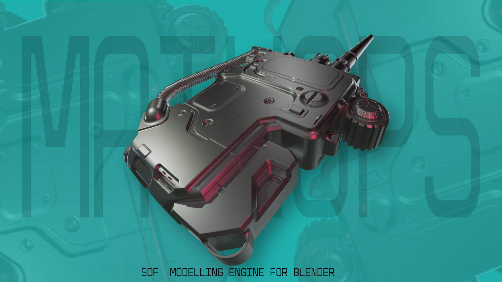

# Blender SDF — Signed Distance Fields in Blender

A [Blender](https://www.blender.org) fork (base: `v5.1-release`) that adds **Signed Distance Fields (SDF)** as a native object type with a real-time GPU ray-marching render engine.

SDFs provide a fundamentally different approach to 3D geometry: instead of storing vertices and faces, shapes are defined mathematically as distance functions evaluated on the GPU. This enables infinite resolution, perfect topology, seamless boolean operations, smooth blending between shapes, and real-time constructive solid geometry at interactive frame rates.



---

## Features

### SDF Primitives

| Primitive | Description | Parameters |
|-----------|-------------|------------|
| **Cube** | Axis-aligned box with bevels and tapered edges | Size, corner bevel, edge chamfer, taper |
| **Sphere** | Sphere or ellipsoid | Radius (uniform or per-axis via scale) |
| **Cylinder** | Capped cylinder | Radius, height, bevel |
| **Cone / Frustum** | Cone to truncated frustum | Bottom radius, height, top radius |
| **Capsule** | Cylinder with hemispherical caps | Radius, height |
| **Torus** | Full circle or capped arc torus | Major radius, minor radius |
| **N-Gon** | Regular polygon prism (3–32 sides) with star mode | Sides, circumradius, height, bevel, chamfer, taper, star |
| **Polygon** | Arbitrary 2D polygon/prism with Bezier-curved edges | 2D control points, height, line width mode |
| **Group** | Container that groups multiple SDFs under shared CSG/blend operations | All CSG and blend parameters |

### Boolean Operations

| Operation | Description |
|-----------|-------------|
| **Union** | Combine shapes (min of distances) |
| **Subtract** | Carve one shape from another |
| **Intersect** | Keep only the overlapping volume |
| **Shell** | Extrude the surface outward/inward with internal cavity |
| **Push** | Subtract from base shape but keep subtractor visible |
| **Avoid** | Shape is automatically carved by all other SDFs in view |

Each operation can be paired with any blend type for a total of **16 CSG × blend combinations**.

### Blend Modes

| Blend | Description |
|-------|-------------|
| **Linear** | Hard min/max — sharp, precise boolean |
| **Smooth** | Polynomial smooth blend with configurable radius |
| **Chamfer** | Beveled edge at the blend boundary |
| **Round** | Spherical outward-convex fillet — soft, organic transitions |

Each blend mode has smooth variants (k2/k3/k4/k5 parameters) for per-object edge softness control. Combine with any boolean operation for smooth subtraction, smooth intersection, chamfered union, etc.

### Native Modifiers

All SDF modifiers appear in the standard Modifier Properties tab and work non-destructively in real time on the GPU.

| Modifier | Description |
|----------|-------------|
| **Mirror** | Mirror across X/Y/Z axes with offset, smooth blend at seam, and mirror-object reference |
| **Array** | Linear or radial duplication with domain folding |
| **Twist** | Twist around any axis with strength control |
| **Bend** | Circular bending around an axis with origin control |
| **Elongate** | Per-axis stretch |
| **Solidify** | Add internal shell: closed (sealed cavity) or open (axis-punched) |
| **Expand/Shrink** | Offset the surface outward or inward |
| **Onion** | Create concentric onion-shell layers |
| **Bevel** | Round/bevel sharp edges |
| **Displace** | Displace surface with 4 noise types |

#### Displacement Noise Types

| Noise | Pattern |
|-------|---------|
| **Noise** | FBM value noise |
| **Voronoi** | FBM Voronoi |
| **Triangle** | Diamond knurl grid pattern |
| **Points** | 3D spherical dots |

---

## Render Engine

The SDF draw engine is a full GPU ray-marching renderer built natively into Blender. It renders directly in the 3D viewport without going through Cycles or EEVEE.

### Shading Modes

- **Studio** — Multi-light studio rotation
- **MatCap** — Spherical environment matcap textures
- **Flat** — Flat/solid color shading

### Mesh Extraction (Dual Contouring)

Convert any SDF scene to a mesh right from the GPU:

1. **Grid Evaluation** — Sample SDF at 3D grid vertices
2. **Dual Contouring** — QEF vertex placement, triangle generation, vertex color sampling
3. Export as mesh data usable by any Blender modifier or exporter

---

## Build from Source

### Prerequisites

- **Git** with LFS support
- **Python 3.10+**
- **CMake 3.25+**
- **Compiler**: MSVC 2019+ (Windows), GCC 14+ (Linux), Clang 15+ (macOS)
- **Ninja** (recommended for fast builds)
- **ccache** (recommended for faster rebuilds)

### Windows

```batch
git clone --recursive https://github.com/JardanX/blender-sdf.git
cd blender-sdf
.\make.bat ninja
```

### Linux

```bash
git clone --recursive https://github.com/JardanX/blender-sdf.git
cd blender-sdf
make full ninja ccache
```

### macOS

```bash
git clone --recursive https://github.com/JardanX/blender-sdf.git
cd blender-sdf
make full ninja ccache
```

---

## What Was Removed

This fork strips several Blender subsystems to reduce build complexity:

- **EEVEE** — Entire render engine removed (~297 files)
- **Metaballs** — Replaced by SDF (DNA kept as tombstones for .blend compatibility)
- **Grease Pencil** — Legacy features removed
- **VSE / Sound / Movie Clip** — Editor UIs removed (libraries kept for dependencies)

---

## License

Blender is licensed under the **GNU General Public License v3**. Individual files may use compatible licenses. See [blender.org/about/license](https://www.blender.org/about/license).
